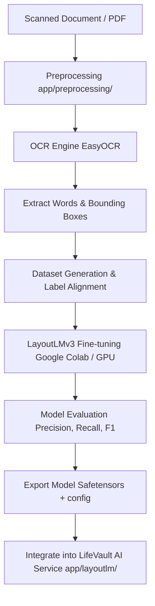

# LifeVault LayoutLMv3 Training Plan (Phase 1)

This training plan defines the machine learning architecture, dataset sizes, training workflow, evaluation metrics, and integration design for fine-tuning **LayoutLMv3** on the LifeVault document dataset.

---

## 1. Machine Learning Pipeline Workflow
The complete end-to-end data and training pipeline is structured as follows:

### Pipeline Description:
1. **Document Input:** The user uploads a file (PDF, PNG, or JPEG) to LifeVault.
2. **Preprocessing:** The file is sent through the universal enhancement pipeline in `app/preprocessing/processor.py` (orientation correction, auto-deskewing, contrast enhancement, and denoising).
3. **OCR Engine:** EasyOCR parses the preprocessed image, extracting raw word segments, confidence levels, and coordinate boxes.
4. **Bounding Boxes:** Word positions are extracted as pixel coordinates: `[x_min, y_min, x_max, y_max]`.
5. **Dataset Generation:**
   - Coordinates are normalized to a `0-1000` scale.
   - Text tokens and boxes are annotated with BIO labels matching our document schema fields.
   - The labeled dataset is split into `train` (80%) and `validation` (20%) sets.
6. **LayoutLMv3 Fine-tuning:** The model is trained using a Google Colab GPU environment.
7. **Model Evaluation:** The training run tracks cross-entropy loss, token-level precision, recall, and F1 score on the validation set.
8. **Export Model:** Weights are serialized in Hugging Face `safetensors` format.
9. **LifeVault AI Service Integration:** The trained model is deployed in our isolated `app/layoutlm/service.py` to classify text tokens and extract key entities, replacing the regex-based parsers.

---

## 2. Evaluation Metrics & Target Values
To validate the model's accuracy on spatial extraction, we will measure:

*   **Precision:** Out of all entities predicted by the model, how many are correct?
*   **Recall:** Out of all actual entities in the documents, how many did the model find?
*   **F1 Score:** Harmonic mean of Precision and Recall. This is the primary metric for token classification.
*   **Entity Accuracy:** Percentage of exact matches (character-by-character or word-by-word) for extracted metadata values (e.g. correct Aadhaar number extracted).
*   **Category Accuracy:** Classification correctness for identifying the document category.

### Acceptable Target Values (Final-Year Project Standard):
For a final-year project context, the following targets demonstrate research-grade feasibility:

| Metric | Target Value | Minimum Threshold | Notes |
| :--- | :--- | :--- | :--- |
| **F1 Score** | **> 85%** | **75%** | Primary metric for spatial NER. F1 > 85% indicates robust layout learning. |
| **Entity Accuracy** | **> 85%** | **70%** | Higher for structured IDs (PAN/Aadhaar) and lower for messy unstructured documents (Resumes). |
| **Category Accuracy** | **> 95%** | **90%** | Classification is a high-level task and should achieve near-perfect metrics. |

---

## 3. Recommended Dataset Size
To train LayoutLMv3 successfully via transfer learning without overfitting, we recommend the following dataset sizes (number of document pages) per category:

| Category | Minimum (Proof-of-Concept) | Good (Baseline Target) | Ideal (Production Ready) |
| :--- | :--- | :--- | :--- |
| **Resume** | 40 | 100 | 250+ |
| **Passport** | 20 | 50 | 150+ |
| **PAN Card** | 20 | 50 | 150+ |
| **Aadhaar Card** | 20 | 50 | 150+ |
| **Student ID** | 25 | 60 | 150+ |
| **Certificates** | 30 | 80 | 200+ |
| **Internship Certificate**| 25 | 60 | 150+ |
| **Fee Receipt** | 30 | 75 | 200+ |
| **Medical Record** | 40 | 100 | 250+ |
| **Insurance Policy** | 40 | 100 | 250+ |
| **TOTAL** | **290** | **725** | **1,900+** |

---

## 4. Expected Integration Points
Once Phase 1 preparation is complete, Phase 2 (Model Integration) will follow these design rules:
1. **EasyOCR Coordinates Reuse:** The `POST /process` route will be modified to run EasyOCR once, storing the token boxes.
2. **LayoutLM Inference Call:** The extracted tokens, boxes, and image will be fed to `layoutlm_service.run_inference()` if the classifier identifies the document as one of the 10 supported types.
3. **Structured Mapping:** The token predictions will be consolidated (e.g. joining consecutive `B-HOLDER_NAME` and `I-HOLDER_NAME` tokens) to construct the final `DocumentMetadata` payload.
